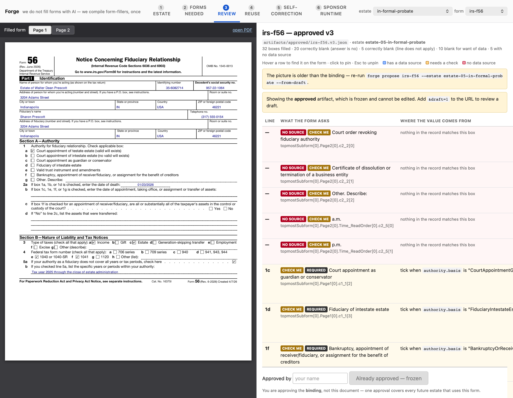
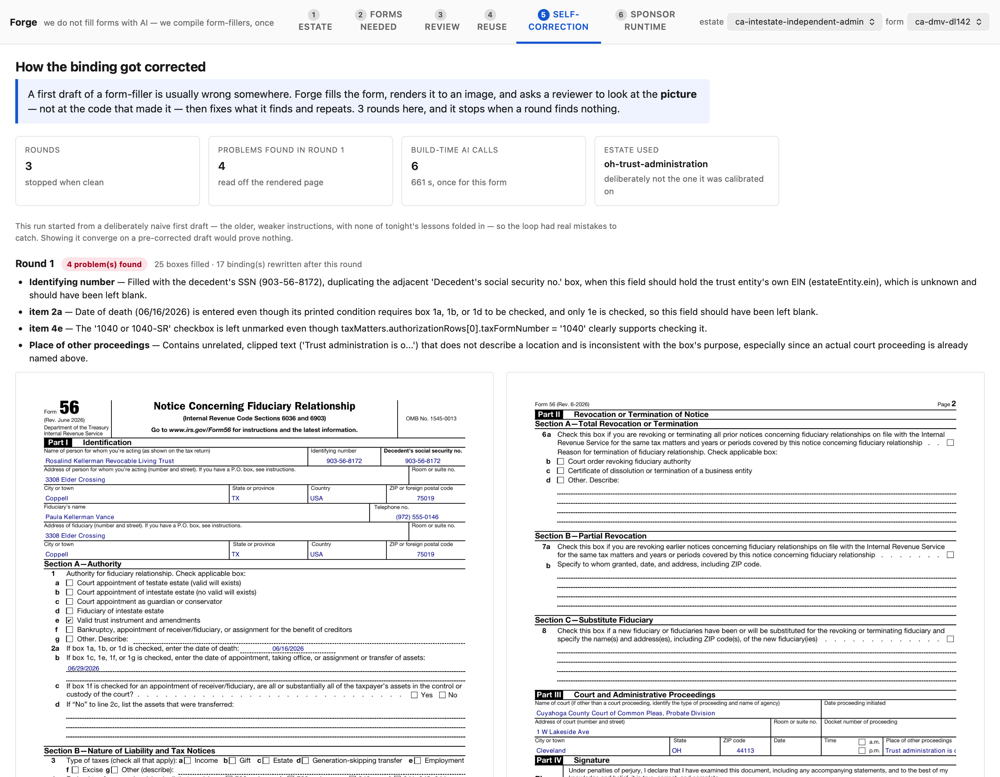
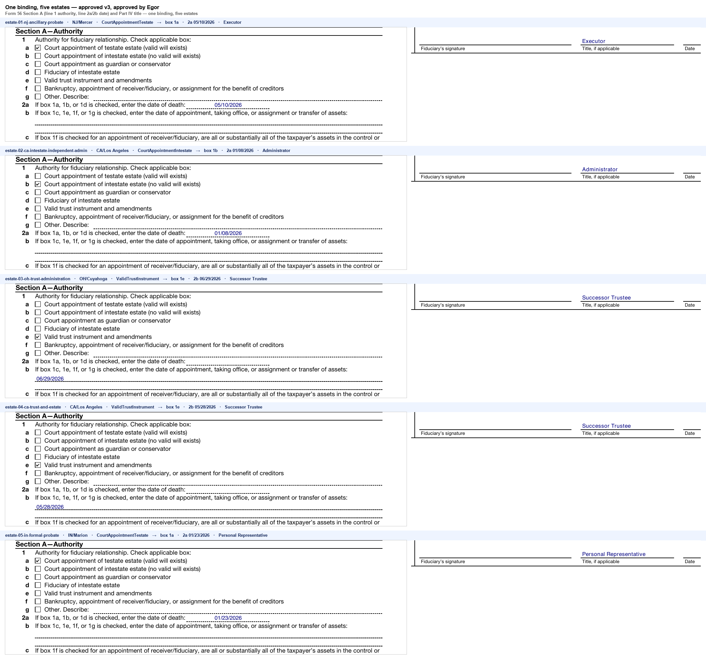

# Warrant + Forge

**Alix "Agents of Administration" hackathon — Tracks 1 and 3, San Francisco, 27–28 July 2026.**

When someone dies, another person — usually a family member, in the worst month of their life —
has to work out which government forms the estate owes, to which agencies, in which order, and
then fill them in correctly. Getting it wrong is expensive and slow, and nobody tells you that
you got it wrong until months later. This system does two things: it decides **which** forms a
particular estate actually needs, with the statute that says so, and it **fills** those forms
from the estate's own records. A human reviews and signs everything before it goes anywhere.

## The one idea

Everyone else at this hackathon asks a model to fill the form on every request. That model is
wrong roughly one time in ten, on every estate, forever, and nobody is watching.

We spend the model **once per form, at build time**, under supervision. It proposes a mapping
from estate data onto the form's boxes; the system fills the form, renders it to an image, and
asks a reviewer to look at the *picture* and say what is wrong; it repairs and repeats until a
round finds nothing. A human then approves the result and it is frozen. After that, filling is
**deterministic: zero model calls, ~40 ms**, forever, for every future estate.

Cold cost: 485 seconds, once per form. Warm cost: ~40 ms per estate.

## The two halves, and where they meet

| | Decides | Built with |
|---|---|---|
| **Warrant** | *Which* forms this estate needs, and why — every decision carries a statute | Tauri 2 + React + TypeScript |
| **Forge** | *How* an unfamiliar form gets filled — one compiled, human-approved binding per form | Python, invoked as a subprocess |

They meet at exactly one file: the **work order**, `forge/artifacts/workorders/<estateId>.json`.
Warrant writes it from its rule pack; Forge reads it and produces only what it says to produce.
That path is live, not described — `src/lib/workorder.ts` writes it, `forge/src/forge/fill.py`
reads it, and the Form Compiler pane runs the whole chain from a button.

Warrant's three-valued logic survives the crossing. A form whose applicability turns on a fact
we do not hold is **not** filed and **not** silently dropped — it arrives marked undecided,
naming the missing fact. Estate 01's DL 142 is the live example: the only identification on file
is a passport, so the licence's issuing state is unknown, so the form is withheld and says so.

## What is actually true, and what proves it

| Claim | Number | Artifact |
|---|---|---|
| Forms compiled from a blank PDF | 4 | `forge/artifacts/calibration/` |
| Bindings approved by a human | 3 — Form 56, SS-4, 8821 | `forge/artifacts/approved/*.json` |
| Fields bound | 67 (F56) · 77 (SS-4) · 39 (8821) · 15 (DL 142, draft) | same |
| One binding, five estates, no model | 5 filled from `irs-f56.v3.json` | `forge/out/demo/reuse.md` |
| Model calls at fill time | **0**, from a counter wired into the model client | `forge/out/fills/*.json` |
| Fill wall time | 39–41 ms per estate | `forge/out/reports/benchmark.md` |
| Cold vs warm | 485 s once per form · ~40 ms per estate | `forge/out/demo/RUNBOOK.md` |
| Live fill through Anvil's API | Form 56, real cast | `forge/artifacts/anvil/irs-f56.json` |
| Tests | 511 TypeScript · 80 Python · 16 Rust | `npm test` · `pytest` · `cargo test --lib` |

`forge/out/` is generated and gitignored; the quickstart below rebuilds it.

### The review UI — a filled form beside the table of where every value came from



### Self-correction — what the loop found by looking at the rendered page



### One approved binding, five different estates



## Quickstart

Needs Node 20+, Python 3.11+, Rust, and poppler (`brew install poppler`).

```bash
git clone https://github.com/Fluxxion88/warrant-forge.git
cd warrant-forge
npm install

python3 -m venv forge/.venv
./forge/.venv/bin/pip install -e forge

# Warrant decides which forms each estate needs, and writes the work orders
npx vite-node tools/emit-workorders.ts

# Forge fills one, deterministically — watch for llmCallsAtRuntime=0
./forge/.venv/bin/forge fill irs-f56 --estate estate-05-in-formal-probate --binding-version 3

# The review UI the screenshots above came from
./forge/.venv/bin/forge review --port 8078      # then open http://127.0.0.1:8078

# The desktop app (separate terminal; leave the review server running)
npm run tauri dev
```

In the app, click **Form compiler** in the left rail. That pane is the merge: the work order at
the top with every form marked needed or not needed and the reason verbatim, each form's compile
state read from `forge/artifacts/`, a **Fill** button that runs the Forge CLI as a subprocess and
shows its exit code, stdout and stderr, and Forge's own review UI in the frame below.

## What does not work

Read this before believing anything above.

- **Accuracy is not measured and is not claimed.** No human has checked a filled form field by
  field against the blank one and recorded the result. We can prove a value came from a named
  path in the record; we cannot yet prove it landed in the right box on every form.
- **Crop escalation has never executed.** The calibration path has a fallback that re-crops and
  re-asks when a field's meaning is unclear. It has never fired on these four forms, so it is
  code that has never run.
- **55 of California's 58 counties are unresearched.** The rule pack's thresholds are real and
  cited, and a handful of counties are modelled. This is a proof that the architecture scales to
  3,000 counties, not a claim that it has.
- **Two data sets, deliberately not forced together.** The Form Compiler pane runs on the
  organisers' five estate records; the rest of Warrant runs on the synthetic Hoyt estate it was
  built against. Merging them properly is a day's work we did not have, and faking it would have
  meant a demo that lies about its own plumbing.
- **Two DL 142 fields are blank because the printed box clips the value**, not because data is
  missing. The date of birth and the cancellation reason both render truncated inside their
  boxes, so the loop unbound them and said why rather than shipping a half-printed date.
- **DL 142 is a draft.** It is compiled but not approved, and `forge fill` refuses to produce a
  document from an unapproved binding rather than falling back to one.
- **The Anvil e-signature chain is unexercised.** One live fill through the API works; the Etch
  signature-packet path has never run.

## One more thing

This is analysis support that a human owns, reviews and signs. It is not legal advice, and
nothing it produces should be filed without a person reading it first.
